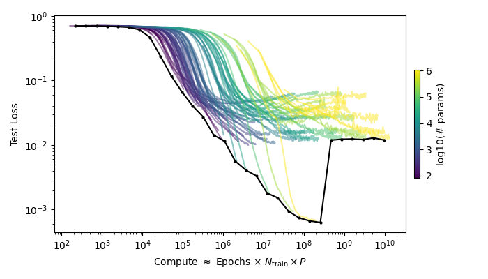

# HiggsClassifier

Small ML experiments on a **physics-motivated jet classification** task: a simulated **Z → b b̄** final state generated with **MadGraph**. Contains:
- **Supervised classification** (signal vs background)
- **Unsupervised / weakly-supervised ideas** (CWoLa-style separation)
- Two broader ML phenomena:
  - **Neural scaling laws** + **compute-optimal** behavior
  - **Double descent**

## Contents

- `HiggstrahlungClassifier_Supervised.ipynb` - 
Trains a neural classifier for signal/background discrimination; explores scaling laws, and calculates the **compute-optimal** scaling law. 

- `HiggstrahlungClassifier_Unsupervised.ipynb` - 
An autoencoder-driven / unsupervised workflow for **CWoLa-style** separation without per-event labels.

- `HiggstrahlungClassifier.py` - 
Defines the MLP and Autoencoder models, training procedures, plotting and more.

- `Datasets/ee_Zbb_noH.lhe` - 
Background Dataset in LHE format.
  
- `Datasets/ee_ZH_Zbb.lhe` - 
Signal Dataset in LHE format.

---

## Background

In collider physics, many searches reduce to learning subtle differences between event classes.
This repo uses a toy-but-realistic setup: simulated **Z → b b̄** events (plus background),
converted into a fixed set of kinematic features and used for classification.

The goal is to understand some modern ML behavior (double descent, scaling trends) in a concrete scientific dataset.

---

## Results

### Compute-optimal scaling
This figure shows the **compute-optimal frontier** (best loss achieved at a given compute budget). 

Compute proxy used here:
`C = n_params × n_steps`

Although the frontier isn’t perfectly smooth (likely due to finite sweeps, optimization noise, and proxy-compute mismatch), it shows a clear scaling trend over a broad range. In particular, the behavior from roughly **10^4 to 10^8** in compute looks close to a clean power-law improvement.

